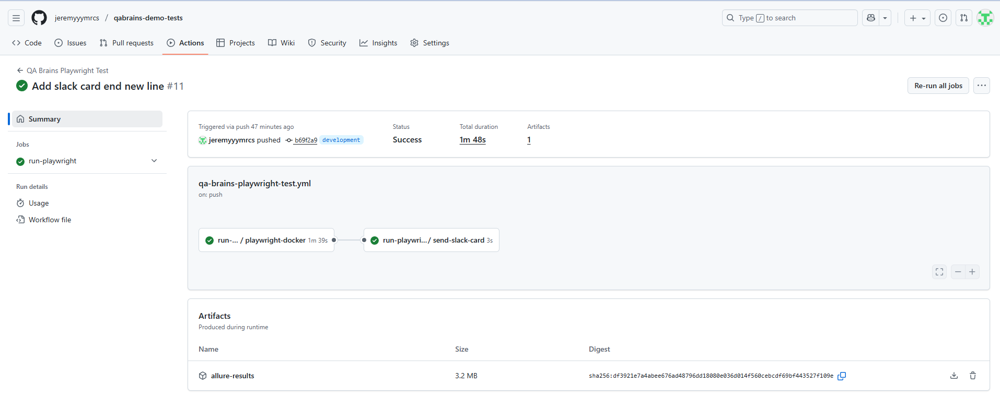
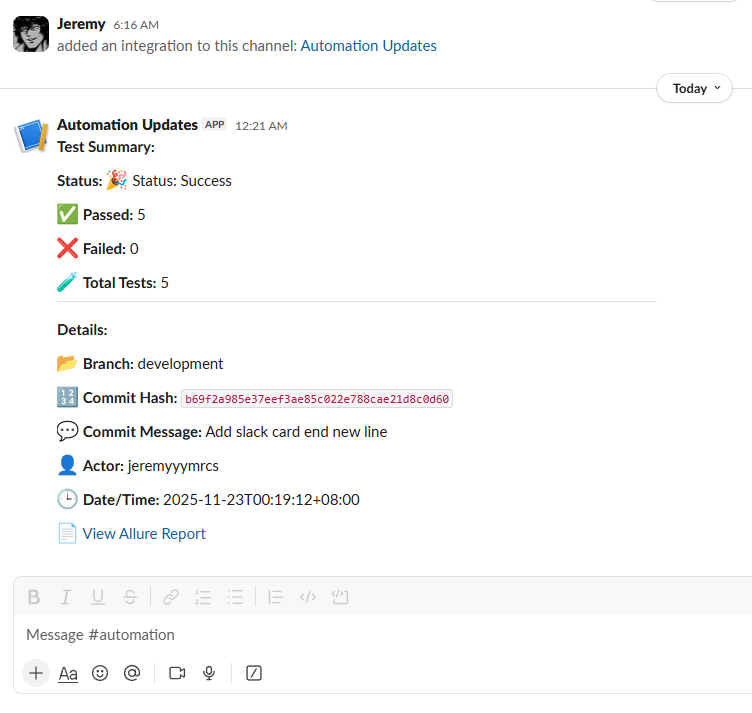
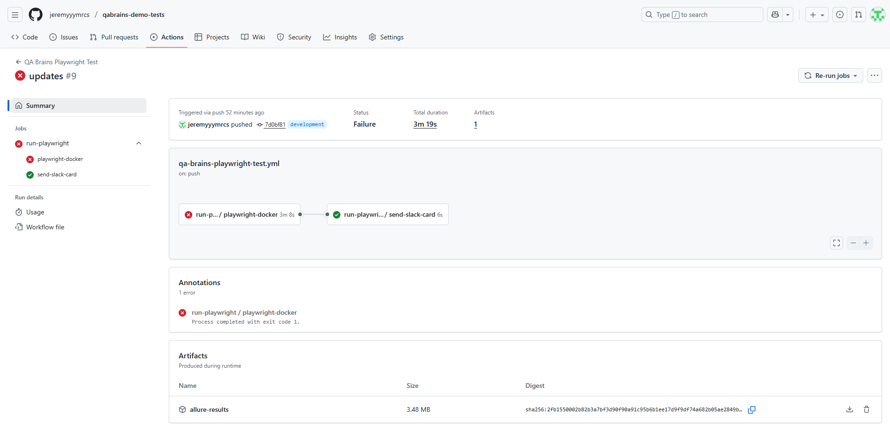
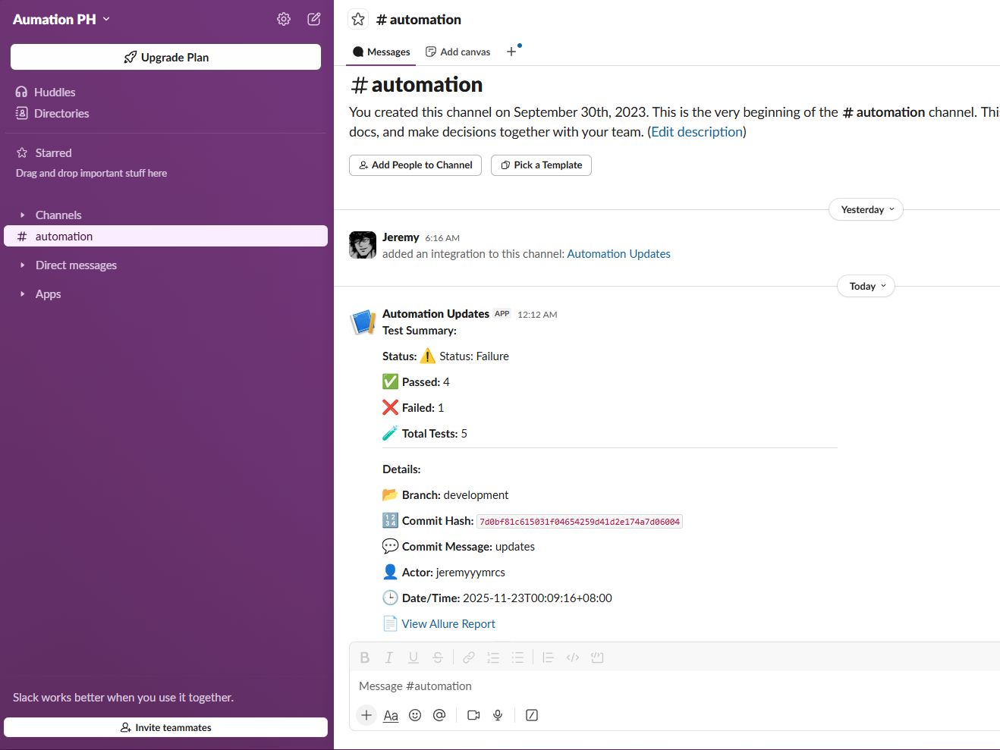

# 🤖 Ultimate Automation Framework

Welcome to the **Ultimate Automation Framework**, designed for robust, scalable, and maintainable test automation using modern tools and best practices.  

This framework leverages **Python**, **Playwright**, **Pytest**, **Allure Reports**, **Docker**, and **CI/CD pipelines** with **GitHub Actions**, following the **Page Object Model (POM)** design pattern.

---

## 👤 About Me

Hi! I’m **Jeremy Marcos**, a passionate automation engineer and software enthusiast.  
I love building **efficient, maintainable, and scalable automation frameworks** using the latest tools and technologies.  
My goal is to make testing simpler, faster, and more reliable for teams everywhere.

Connect with me:  
- GitHub: https://github.com/jeremyyymrcs
- LinkedIn: https://ph.linkedin.com/in/jeremy-marcos-484381247  

---

## 🛠 Tools and Frameworks

| Tool / Framework      | Version | Download / Documentation                                        |
|-----------------------|---------|-----------------------------------------------------------------|
| **Python**            | 3.12.x  | [Download Python](https://www.python.org/downloads/)            |
| **Playwright**        | 1.43.x  | [Playwright Docs](https://playwright.dev/python/docs/intro)     |
| **Pytest**            | 7.4.x   | [Pytest Docs](https://docs.pytest.org/en/stable/)               |
| **Allure Report**     | 2.21.x  | [Allure Docs](https://docs.qameta.io/allure/)                   |
| **Slack API Webhook** | -       | [Slack API](https://api.slack.com/apps/)                        |
| **Docker**            | 24.x    | [Download Docker](https://www.docker.com/get-started)           |
| **GitHub Actions**    | -       | [GitHub Actions Docs](https://docs.github.com/en/actions)       |
| **Git**               | 2.42.x  | [Download Git](https://git-scm.com/downloads)                   |
| **PyCharm**           | 2025.x  | [Download PyCharm](https://www.jetbrains.com/pycharm/download/) |

> ⚡ **Note:** Versions can be updated based on your environment or project requirements.

---

## 🔒 Security and Secrets Management

This framework is designed with security in mind. All sensitive information, such as API keys, credentials, or tokens, is handled securely:

- **Environment Variables:** Secrets are stored in `.env` files and accessed via the `env_config.py` utility.
- **Encryption:** Sensitive data is encrypted where applicable to prevent accidental exposure.
- **CI/CD Security:** GitHub Actions workflows use **encrypted secrets** to keep credentials safe and prevent them from being logged.
- **No Hardcoding:** Secrets are **never hardcoded** in the codebase or repository.

> ⚡ **Note:** Always ensure your `.env` files are added to `.gitignore` to avoid accidentally committing secrets to the repository.

---

## 🎨 Design Pattern

This framework follows the **Page Object Model (POM)**, which helps in:

- Maintaining clean and modular code.
- Enhancing test readability.
- Simplifying test maintenance.

**Structure Example:**
```
Directory structure:
└── jeremyyymrcs-qabrains-demo-tests/
    ├── Dockerfile
    ├── LICENSE
    ├── pytest.ini
    ├── requirements.txt
    ├── .dockerignore
    ├── .env.example
    ├── locators/
    │   ├── __init__.py
    │   └── base.py
    ├── pages/
    │   ├── __init__.py
    │   ├── base_page.py
    │   ├── forgot_password_page.py
    │   ├── form_submission_page.py
    │   ├── login_page.py
    │   └── registration_page.py
    ├── reports/
    │   └── __init__.py
    ├── test_data/
    │   ├── __init__.py
    │   └── generate_fake_data.py
    ├── tests/
    │   ├── __init__.py
    │   ├── base_test.py
    │   ├── test_form_submission.py
    │   ├── test_login.py
    │   ├── test_registration.py
    │   ├── test_reset_password.py
    │   └── docker/
    │       ├── pytest_summary.sh
    │       ├── run_all_test_suites.sh
    │       ├── run_form_submission_test.sh
    │       ├── run_login_test.sh
    │       ├── run_registration_test.sh
    │       ├── run_reset_password_test.sh
    │       └── test_runner_utility.sh
    ├── utils/
    │   ├── __init__.py
    │   ├── actions_handler.py
    │   ├── custom_logger.py
    │   └── env_config.py
    └── .github/
        ├── scripts/
        │   ├── run-playwright-tests.sh
        │   ├── send-slack-card.sh
        │   └── send-teams-card.sh
        └── workflows/
            ├── qa-brains-playwright-test.yml
            └── run-qa-brains-playwright-test.yml
```

## 📊 Test Results and Reporting

### 🔔 Slack Notification Integration

This framework includes an automated Slack notification system that sends a detailed summary of each test run executed in GitHub Actions.  

The Slack notifications include:

- ✔ **Overall test status** (Passed / Failed)  
- ✅ **Number of passed tests**  
- ❌ **Number of failed tests**  
- 🧪 **Total test count**  
- 🌿 **Git branch** and 🔢 **commit information**  
- 👤 **Actor** who triggered the workflow  
- 🕒 **Date and time** of execution  
- 📄 **Direct link** to the GitHub Actions run and Allure report  

These notifications help your team **quickly monitor test results** without manually checking GitHub Actions or opening reports.

---
### ✅ Sample Passed Test
Below is an example of a successful test execution:




### ❌ Sample Failed Test
Below is an example of a failed test execution:




